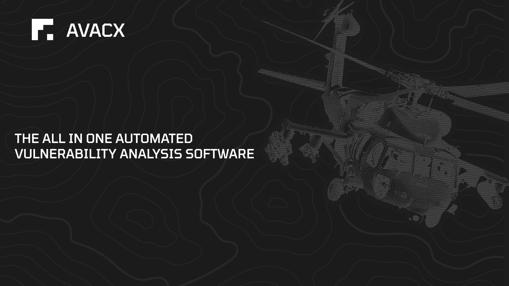

<p align="center">
  <a href="#" target="_blank" rel="noopener noreferrer">
    
  </a>
</p>

## Overview
HAWKNET is a cutting-edge, open-source, cross-platform desktop application designed to provide users with a seamless experience in managing and interacting with various AI models. Built using Tauri and Rust, Hawknet offers a lightweight and efficient solution for developers and enthusiasts looking to harness the power of AI in their workflows.


## Getting Started

```
# 1. Install dependencies
pnpm install

# 2. Start the development server
pnpm tauri dev
```