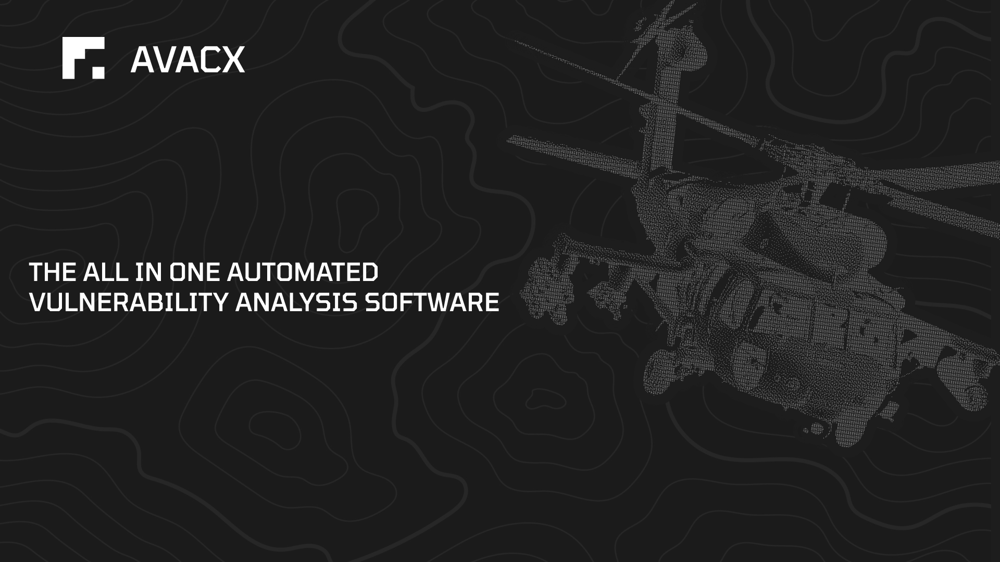
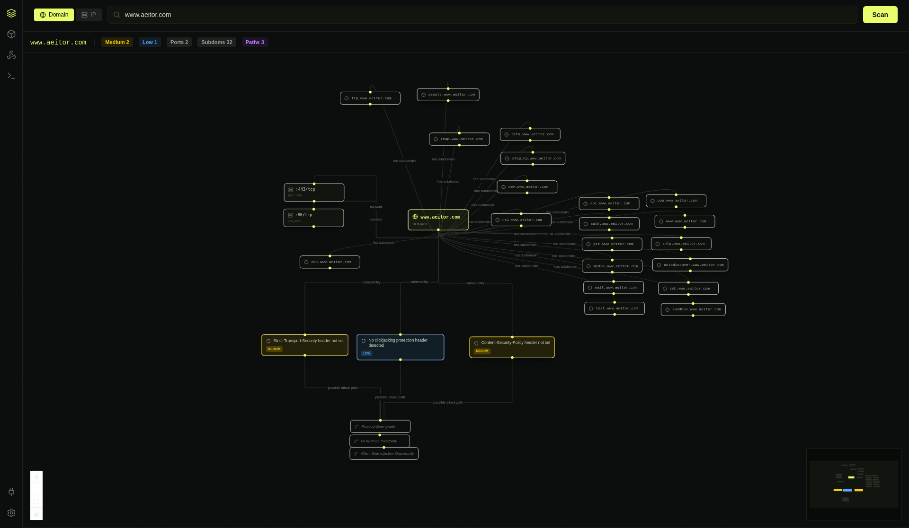
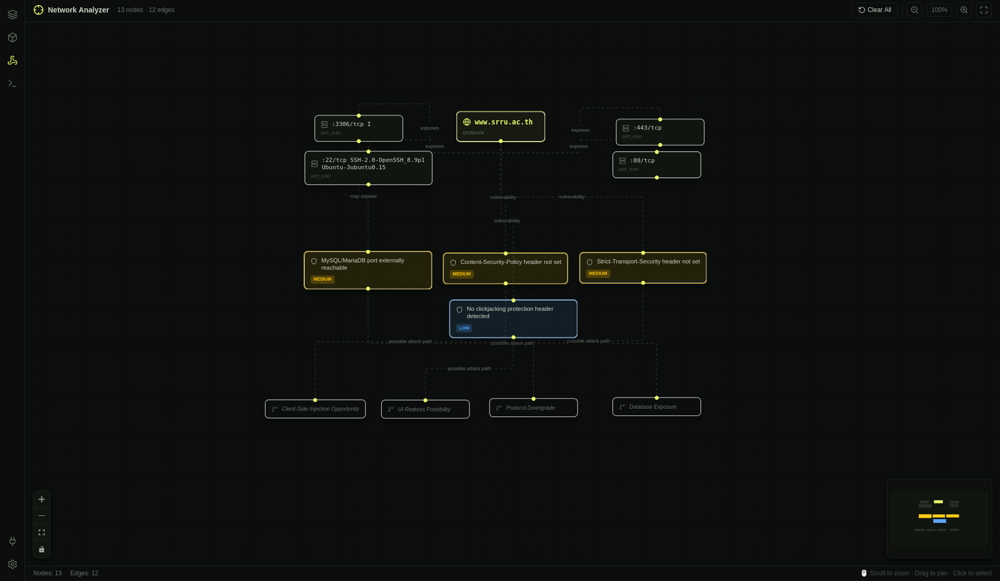
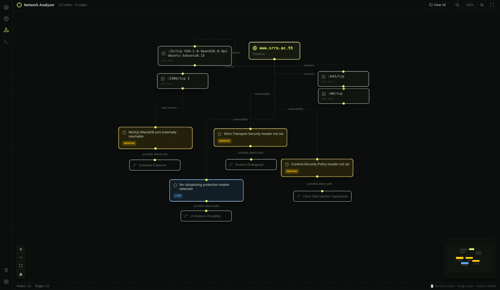
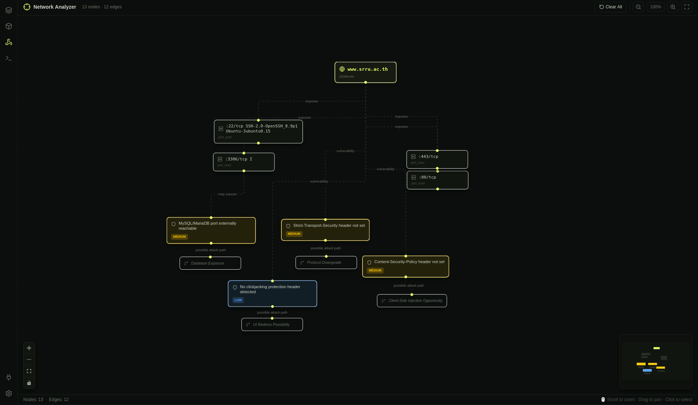

<p align="center">
  <a href="#" target="_blank" rel="noopener noreferrer">
    
  </a>
</p>

<p align="center">
  <a href="https://avacx.com" target="_blank">
    
  </a>
  &nbsp;
  <a href="https://discord.gg/QVnHXT5ve2" target="_blank">
    
  </a>
  &nbsp;
    <a href="https://www.instagram.com/avacxint" target="_blank">
    
  </a>
</p>


## ภาพรวม (Overview)
HAWKNET คือเดสก์ท็อปแอปพลิเคชันแบบโอเพ่นซอร์ส (Open-source) ที่รองรับการทำงานข้ามแพลตฟอร์ม (Cross-platform) ได้รับการออกแบบมาเพื่อให้ผู้ใช้งานได้รับประสบการณ์ที่ราบรื่นในการจัดการและโต้ตอบกับโมเดล AI ต่างๆ ตัวแอปพลิเคชันพัฒนาขึ้นโดยใช้ Tauri และ Rust ทำให้ Hawknet เป็นโซลูชันที่มีน้ำหนักเบาและมีประสิทธิภาพสูงสำหรับนักพัฒนาและผู้ที่สนใจในการนำพลังของ AI มาใช้ในกระบวนการทำงาน

> ประกาศทางกฎหมาย: HAWKNET มีวัตถุประสงค์เพื่อใช้สำหรับการวิจัยด้านความปลอดภัยและการทดสอบเจาะระบบ (Penetration Testing) เท่านั้น โปรดใช้งานอย่างมีความรับผิดชอบและมีจริยธรรม ทางเราจะไม่รับผิดชอบต่อการนำไปใช้ในทางที่ผิดหรือความเสียหายใดๆ ที่เกิดขึ้นจากเครื่องมือนี้ สามารถอ่านข้อจำกัดความรับผิดชอบทางกฎหมายฉบับเต็มได้ที่ [LEGAL](/.guidebook/legal.md)

<div align="left">

| ภาษาอื่น ๆ (Others Language) | README.md |
|:---:|---|
| **[ภาษาไทย](./i18n/TH-Thai/README-TH.md)** | อ่านเอกสารฉบับภาษาไทย |

</div>

## การทำงานของ HAWKNET (HAWKNET in Action)

<div align="center">
<table>
<tr>
<td></td>
<td></td>
</tr>
<tr>
<td></td>
<td></td>
</tr>
</table>
</div>


## เริ่มต้นใช้งาน 

คัดลอกไฟล์ Environment
```
cp .env.example .env ./src-tauri/.env.example ./src-tauri/.env
```
```
# 1. ติดตั้ง Dependencies 
pnpm install

# 2. เริ่มทำงานโปรแกรมจำลองสำหรับนักพัฒนา (Development Server)
pnpm tauri dev
```

## ฟีเจอร์
-การสแกนเพื่อเก็บข้อมูลและตรวจการณ์ (Reconnaissance Scan)
-การแสดงข้อมูลรางวัลช่องโหว่ (Display Bounty)
-การวิเคราะห์ด้วยกราฟ (Graph Analysis)
-การเชื่อมต่อร่วมกับโมเดล AI (AI Model Integration)
-ระบบจำลองภัยคุกคาม (Threat simulation / Threanet)